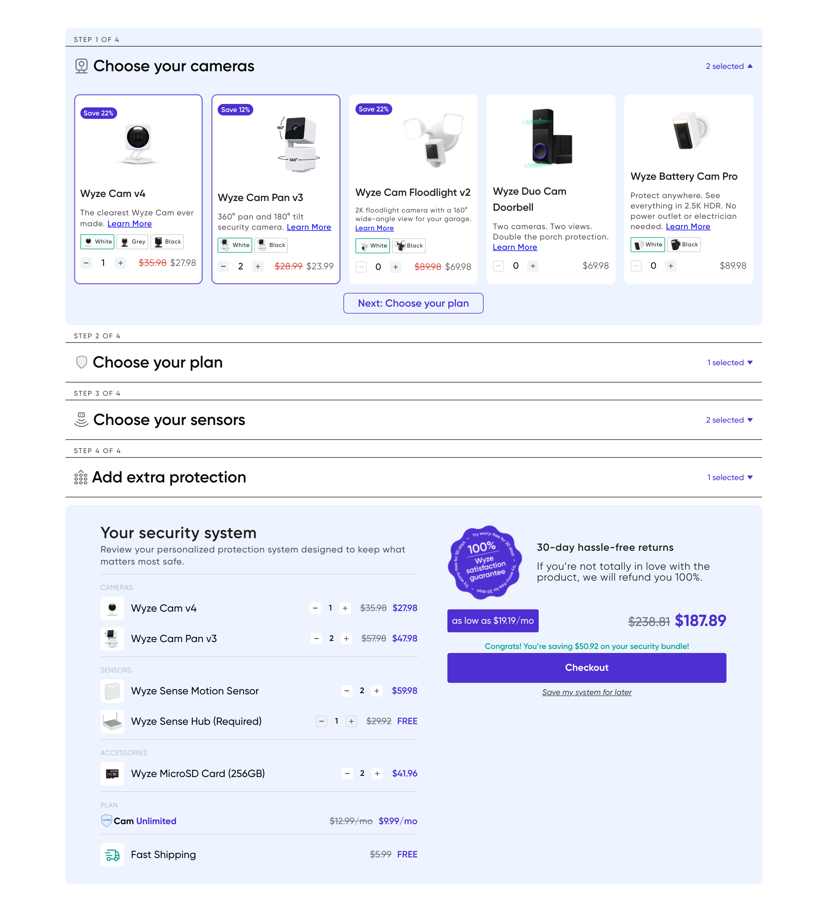
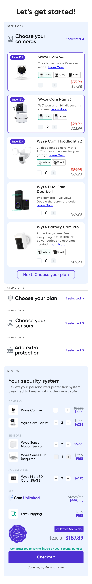

# Wyze Bundle Builder

A multi-step **bundle builder** with a live **review panel**, rebuilt from the Figma design
as a production-quality React prototype. Configure cameras, a plan, sensors, and extra
protection on the left; the "Your security system" summary on the right updates live.

<p align="center">
  
</p>

---

## Tech stack

| Concern | Choice |
|---|---|
| Framework | React 18 + Vite |
| Language | TypeScript |
| Styling | Tailwind CSS (design tokens in `tailwind.config.js`) |
| State | Redux Toolkit (one `bundleSlice` + typed hooks + memoized selectors) |
| Data | Catalog-driven JSON (`src/data/bundle.json`) |
| Backend (bonus) | Node.js + Express serving `GET /api/bundle` |
| Persistence | `localStorage` ("Save my system for later") |

---

## Run it (from a clean clone)

```bash
npm install
```

**Frontend only** (data loads from the bundled JSON fallback — no backend needed):

```bash
npm run dev
# → http://localhost:5173
```

**With the bonus backend** (frontend fetches the catalog from the API; Vite proxies `/api`):

```bash
npm run dev:all      # runs the Vite dev server + the Node API together
# or in two terminals:
#   npm run server   # http://localhost:4000/api/bundle
#   npm run dev      # http://localhost:5173
```

**Production build:**

```bash
npm run build && npm run preview
```

---

## How it works

### Data-driven
Everything renders from `src/data/bundle.json` — steps, products, variants, pricing, and the
seed quantities. No per-product markup is hardcoded. The bonus Express server reads and serves
that **same** file (`server/index.js`), so there is a single source of truth; if the API is
down, `api.service.ts` falls back to the local JSON so the app always runs.

### Variant-scoped quantities (the tricky part)
Every product is modelled as a list of variants — products with no colour options just have a
single variant. Selections are keyed by `productId:variantId`, so **each colour tracks its own
quantity**. The card's stepper is bound to the product's *active* variant: add 2 White, switch
to Black, and the stepper reads `0` while White ×2 is untouched. The review panel lists **every
variant with qty > 0 as its own line**.

### Synced steppers
The card stepper and the review-panel stepper for the same item dispatch the *same* Redux
action against shared state, so they stay in sync automatically — change one and everything
updates (and the total recalculates).

### State shape
```ts
{
  openStepId,                          // accordion (Step 1 open on load)
  quantities: { "cam-v4:white": 1 },   // every variant, independently
  activeVariant: { "cam-v4": "white" } // which chip the card stepper edits
}
```
Review lines, the "N selected" counts, and all totals are **derived** via selectors, never
stored.

### Persistence
"Save my system for later" writes the configuration to `localStorage` (versioned key). On load,
if a saved system exists it's restored verbatim; otherwise the design's seed is applied. Try it:
change quantities → click the link → reload → your system is restored.

---

## Decisions & tradeoffs

- **Redux Toolkit over Context** — matches the project's reference conventions and keeps the
  selection logic, derived selectors, and persistence cleanly separated from the UI.
- **One mockup inconsistency, resolved toward the hero numbers.** In the Figma, the *Wyze Cam
  Pan v3 card* is labelled `$39.98 / $34.98`, but the *review panel* shows that same item (×2)
  as `$57.98 / $47.98` (≈ `$28.99 / $23.99` each) — the two can't both be unit-true. I chose the
  values that make the prominent **total ($187.89)**, **compare-at ($238.81)**, and **savings
  ($50.92)** exact, since those are the headline figures the design and task call out. The seed
  reproduces the review panel precisely.
- **Pricing model** — the review panel shows line totals (unit × qty); cards show the unit
  price. `compareAt` defaults to the active price when there's no discount; "free" items (the
  required Sense Hub, shipping) contribute to the compare-at total but `0` to the subtotal,
  which is how the `$50.92` savings is built.
- **Font** — the design's **Gilroy** family (Bold / SemiBold / Medium / Regular + italics) is
  bundled in `src/assets/fonts/` and wired up with `@font-face` in `src/index.css`, so the
  typography matches the design out of the box (system-font fallback if the files are ever
  removed).
- **Required Sense Hub** renders a **locked/disabled stepper**, matching the design's greyed
  control.
- **Checkout** is a placeholder (shows a confirmation), as specified.

---

## Responsiveness

The Figma has **two desktop frames**, and the app implements both as responsive states:

- **Wide (≥1280px)** — the full-width frame (`node 70-14135`): builder spans the full width with
  **5 vertical cards across**, and the review panel sits **below** as a wide 2-column block
  (line items left; satisfaction badge, "30-day hassle-free returns", financing, total, and
  Checkout right).
- **Laptop (1024–1280px)** — the side-by-side frame (`node 68`): builder on the left with
  **2 horizontal cards across**, and a **sticky compact review sidebar** on the right.
- **Tablet (768–1024px):** single column — builder on top (2-up), review compact below.
- **Mobile (<768px):** fully stacked with the "Let's get started!" title (which only appears at
  phone size, matching the iPhone frame); cards go single-column and all controls stay tappable.

Cards morph from horizontal (image left) to vertical (image on top) at the `xl` breakpoint, and
the review panel morphs from a stacked column to the wide 2-column layout — all via Tailwind
responsive utilities (no duplicated markup).

<p align="center">
  
</p>

### Pixel-level card fidelity
The wide-frame product cards are matched to the Figma to the pixel: a fixed **225 × 331px** card,
per-product image-box heights, and per-product image alignment (e.g. Pan v3 dropped below the
Save badge and anchored to the right corner; the Floodlight's longer copy kept at 12px so
"…with a 160°" stays on line one). Images use `object-contain` inside a fixed box, so the whole
product always shows and is never cropped.

---

## Project structure

```
server/                Node/Express backend (GET /api/bundle)
src/
  components/
    ui/                QuantityStepper, PriceTag, Badge, icons
    builder/           Builder, AccordionStep, StepHeader, ProductCard, VariantSelector, PlanCard, NextButton
    review/            ReviewPanel, ReviewGroup, ReviewLine
  store/               Redux store, typed hooks, slices/bundleSlice (+ selectors)
  services/            api.service (fetch + fallback), persistence.service (localStorage)
  data/                bundle.json  ← single source of catalog data
  types/               bundle.types.ts
  utils/               formatMoney, selection helpers
public/images/         product PNGs + satisfaction badge
```

---

## What I'd do next with more time

- Unit tests for the totals/selector logic and a couple of interaction tests.
- Per-variant product images for the colour swatches that currently reuse the main image.
- Wire the API through React Query for caching/retries instead of the hand-rolled fetch +
  fallback.
